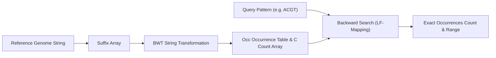

# FM-Index Genomic Sequence Aligner Skill

Ferragina-Manzini (FM) index implementation leveraging the Burrows-Wheeler Transform for sublinear genomic pattern searching.

## Features
- **100% Python Standard Library**: Pure suffix sorting and backward search logic.
- **Fast Backward Search**: Pattern matching proportional to query length \(O(m)\).
- **Exact Count Capabilities**: Instant frequency reporting across large references.
